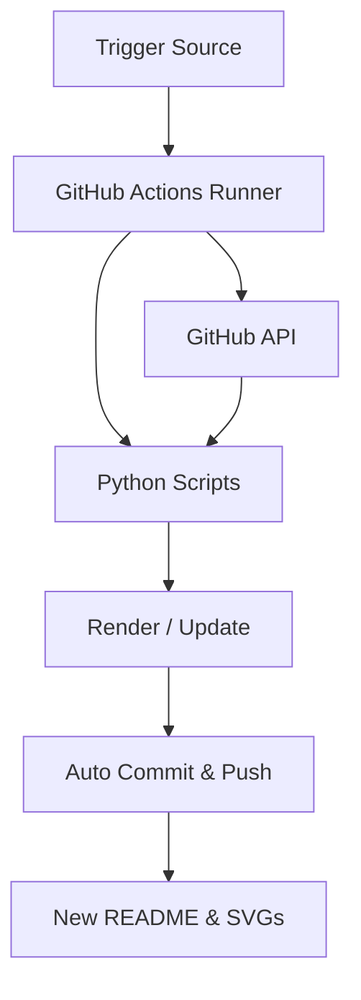

# How It Works: Automated Profile README

This document explains the architecture, workflow, and scripts used to automate profile stats, SVG graphics, and daily quotes on the GitHub profile page of **DycandX**.

---

## 1. General Architecture & Data Flow

This automation system uses an event/schedule-based approach, visualized using the Mermaid diagram below:

1. **Trigger Source**: GitHub Actions is executed either via a direct code `push` to the `main` branch, or from an external signal using **Workflow Dispatch** (via the API).
2. **Data Collection**: The GitHub Actions runner executes Python scripts to call the **GitHub GraphQL & REST APIs** to fetch the latest developer activity statistics.
3. **SVG Rendering**: Python scripts re-render the SVG representation files (`info-card.svg`, `contrib-heatmap.svg`).
4. **Daily Quote**: A Python script fetches a random quote from an external API and inserts it into the `<!-- QUOTE_START -->` placeholder inside `README.md`. It has a local fallback mechanism if the API is down.
5. **Storage**: Any detected changes are automatically committed and pushed back to the repository, updating the profile page instantly.

---

## 2. Project Files & Structure

Here are the key files running this workflow:

### A. Python Scripts (`/scripts` & Root)

- **`today.py`**: The main script that calculates general statistics from the GitHub API (repositories, stars, total lines of code / LOC, account age, etc.) and writes them to `data/stats.json`.
- **`scripts/fetch_contributions.py`**: Script to fetch daily contribution history to construct the contribution matrix stored in `data/contributions.json`.
- **`scripts/make_info_card.py`**: Script that renders the Neofetch-style terminal info card (`info-card.svg`) using the data from `data/stats.json`.
- **`scripts/render_heatmap_svg.py`**: Script that renders the daily contribution grid (`contrib-heatmap.svg`) based on `data/contributions.json`.
- **`scripts/update_quote.py`**: Script to fetch a random quote from the ZenQuotes API and insert it into the `README.md` placeholder. Includes a local fallback system.

### B. CI/CD Configuration

- **`.github/workflows/build.yaml`**: The GitHub Actions workflow definition. It manages python dependencies installation, running the data scripts, rendering SVGs, updating the quote, and executing the git auto-commit action.
