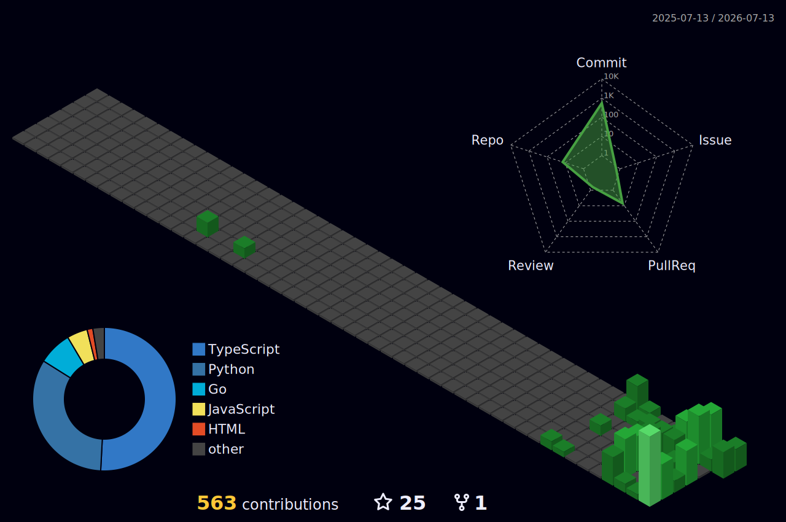

<table>
<tr>
<td valign="top"></td>
<td valign="top"></td>
</tr>
</table>

## Zulvikar Kharisma Nur Muhammad

**Fullstack Developer · AI Builder · Computer Engineering Student**

 

<!-- QUOTE_START -->

<i>"Routine life is unbearable, and most people only think about how to escape into the world of fantasy and dreams."</i> — <b>Robert Greene</b>

<!-- QUOTE_END -->

  

  

